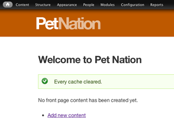

# Pet Nation Theme Development

By Tina Holly



This is the theme-specific readme file. It contains information on how to work with the theme.

1. Install the Ruby command line tool Compass
2. Installing required gems (Zen Grids, Breakpoint for Responsive Design)
3. Using Compass
4. Understanding SASS

## Installing Compass

Installing Compass on a Mac is easy. Mac comes with Ruby installed. To confirm that you have Ruby, type the following command:

```bash
which ruby
```

You should get `/usr/bin/ruby`. If you don't see anything then you don't have Ruby installed. Please use Google to learn how to install Ruby on your machine.

Next, run the command to update Ruby to make sure it's up to date. Then install Compass.

```bash
$ sudo gem update --system
$ sudo gem install compass
$ sudo gem install zen-grids
$ sudo gem install breakpoint
```

Note: `$` is a placeholder for your Terminal's prompt. You don't type it.
If you are installing Zen Grids while Compass is running you will need to restart Compass for the changes to come into effect.

## Using Compass to compile SCSS files into CSS files

In the Terminal, change to the theme directory. This is the directory with the `config.rb` file. 

The following command is assuming you are in the `da_pet_nation` profile.

```bash
cd themes/petnation
sudo compass watch
```

Compass needs sudo privileges to overwrite your files. I don't know why, just do it. :)

That's what you need to know to work with the files I will set up. For further reading on Compass [visit their website](http://compass-style.org/) (optional reading).

## Understanding SASS

Please read the following articles to learn about SASS (mandatory reading).

- Official documentation for SASS (see tutorial section but do not run any Terminal commands—Compass, if running, handles that): [sass-lang.com](http://sass-lang.com/)
- [David Walsh on Redesigning with SASS - CSS Tricks](http://css-tricks.com/redesigning-with-sass/)
- Wikipedia entry on SASS: http://en.wikipedia.org/wiki/Sass_(stylesheet_language)
- [SASS vs SCSS file extensions](http://thesassway.com/articles/sass-vs-scss-which-syntax-is-better) *We will be using SCSS!*
- [Screencast: Intro to Compass/SASS - CSS Tricks](http://css-tricks.com/video-screencasts/88-intro-to-compass-sass/)
- [Zen Grids documentation](http://zengrids.com/)

### Example SASS (SCSS) code

#### Variable
```scss
$ptsans: 'pt sans caption', 'helvetica neue', tahoma, sans-serif;
```
##### Usage
```scss
font-family: $ptsans;
```
#### Mixin
```scss
@mixin font($fam,$weight,$size,$lh) {
    font-family: $fam;
    font-weight: $weight;
    font-size: $size;
    line-height: $lh;
}
```
##### Usage
```scss
.my_element {
    @include font($ptsans,700,1em,1em);
}
```
Notice a variable was thrown in there too. ;)

### Nesting
Nesting makes it contextually easier to work with CSS—CSS specificity displayed graphically!

```scss
p, ul, ol {
    margin-bottom: 0.6em;
    line-height: 1.4em;
    font-size: 0.9em;
}
ul, ol {
    ul, ol {
        margin-bottom: 0;
    }
}
```
The above code shows that all `p, ul, ol` have the aforementioned properties but that lists nested within lists (i.e. `ul ul` and `ol ol`) have their bottom margins removed. 

```scss
nav {
    a {
        color: darkturquoise;
    }
}
```

The above code makes all links in `nav` the colour `darkturquoise`.

### CSS Comments
Comments in SCSS can be done using `//`

In Sublime, you can highlight an entire block of code and press `cmd+/` to comment it out.

```scss
h1 {
    font-size: 1.5em;
    letter-spacing: -1px;
    &.page-title {
        // font-size: 1.6em;
        color: lighten($darkgrey,20%);
    }
}
```

Font-size for `h1.page-title` will not be declared. `&` denotes where you are **plus** the class. You can also use `&:hover {...}` to declare a hover state:

```scss
nav {
    a {
        color: darkturquoise;
        &:hover {
            text-decoration: underline;
        }
    }
}
```
Using the `&` is optional but keeps the code cleaner.

## Using Zen Grids and Breakpoints

This is by far not a replacement for visiting the [Zen Grids documentation](http://zengrids.com/) but can serve as a quick reference for using the grid system.

We are on a 12-column grid for this project. Our content area is 960 pixels wide in desktop.

```scss
#main {
    background: lightgrey; // dev only - noproduction
    @include zen-grid-item(9,1); // 9 columns wide (out of 12), in spot 1 out of 12
    @include breakpoint($mobile) {
        @include zen-grid-item(12,1); // 12 columns (full width), in spot 1
    }
}

#secondary-menu {
  @include zen-grid-item(4,9); // 4 columns wide, starting in spot 9 (pushed 8 columns)
  text-align: right;
  @include breakpoint($mobile) { // in-context media queries
    @include zen-grid-item(12,1); // full-width in mobile
    text-align: center;
    margin-top: 20px;
  }
}
```

## Further Reading (Optional)

- [Controlling colours in SASS](http://robots.thoughtbot.com/post/12974565313/controlling-color-with-sass-color-functions)

# Configuring Views and Display Suite for Optimum Theming

## Views
Views has the ability to add classes to everything. It's best to add classes to areas that are definitely going to change from default styles, e.g. labels.

In the event that a 2-column layout is required in a view, it would be beneficial to group columns in their own wrapper. One of the ways this is done is by creating a `Global: Custom Text` field and refer to your desired fields like this: `[field_date]` in there. If doing it this way, do not add your static markup in this box, instead add it to the individual fields by wrapping it in an element of your choice and adding a CSS class through the UI, as opposed to hard-coding it. 

## Display Suite

Larger parts of the layout can be customized using Display Suite like the whole layout or regions. You can add classes to columns. 

For the Dog Profile page, I chose a simple layout (3 columns) and in CSS customized it by dropping one column to create a major full-width area below. That's one way to customize the layout.

If you need to get as deep as adding classes to fields, this is not available out of the box. You would need the module `ds_extras` enabled. You would also need the setting "Add field templates" enabled.

## Sharing your Changes

After updating a View or Display, I did `drush fu pn_feature_name`
to update the Feature in the module code then pushed changes to Git to make the same settings available to all.

If you had to enable a setting like I did with `ds_extras` to get a display to function properly, it may not be Featurizable the traditional way by featurizing a Display Suite or Views layout. If it isn't, the setting can quite possibly be exported using variable set through Features Strongarm.

The `ds_extras` setting can be exported using Features and Strongarm as there is a variable available for us to set. Anything with an entry in the `variables` table in the database can be Featurized as a Strongarm setting. You can inspect the element to find any ID's that match the machine name of the module and then search that value in the variables table in the database. If it exists, it is most likely Featurizable. 